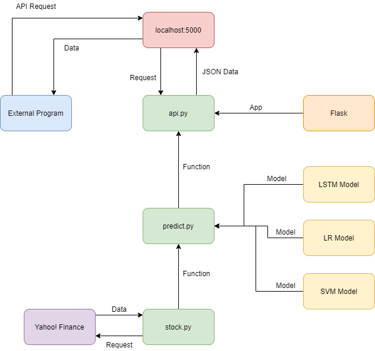
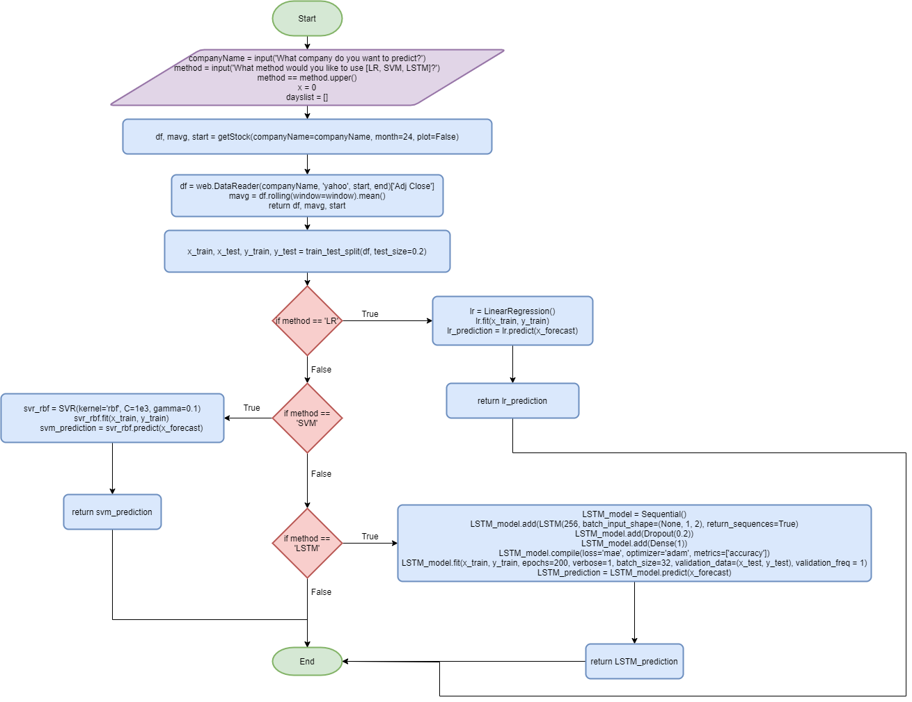

# FAQ

## Introduction

### Give a d**etailed** description of your project including user/s and user requirements and your aims.

Our Project is a **Stock Market Prediction tool** that utilises `Machine Learning` algorithms in models such as `Linear Regression` and `Support Vector Machine` in order to forecast the Stock Market changes for a certain period of time in the future. Our aims are to develop the tool as a python package and upload it to `PyPi` as an open source package for use all around the world. We want to allow for multiple different algorithms to be used through the use of multiple `function` and `iteration` to make the results as accurate and reliable as possible. We expect the package to be finished within 3/4 weeks. 


For more up-to-date info, look [here](https://aru300.gitbook.io/summer-project/#introduction).


### Who are the users?

Users would be anyone over the age of **18,** attempting to _build_ or to _improve_ their **financial portfolio.** _****_Our tool will aid them in **investing** and **buying** shares from companies as well allowing them to maximise the profits and minimise their losses. It also allows more inexperienced users to attain an understanding of the movement of the **Stock Market** allowing them to make informed decisions about their future.



## **System Design**

### Show understanding of how to model a **complex** system by only including **essential** details.

A complex system is one which contains multiple different files/components which interact with each other. For example:

```perl
|   .gitattributes
|   .gitignore
|   .readthedocs.yml
|   api.py
|   LICENSE
|   MANIFEST
|   mkdocs.yml
|   README.md
|   requirements.txt
|   setup.cfg
|   setup.py
|   SUMMARY.md
|   _config.yml
|
+---.vscode
|       launch.json
|
+---dist
|       Summer-Project-1.2.tar.gz
|       Summer-Project-2.0.tar.gz
|
+---docs
|       README.md
|       _config.yml
|
+---site
|       README.md
|
+---StockAnalysis
|   |   Predict.py
|   |   Stock.py
|   |   test.py
|   |   __init__.py
|   |
|   \---__pycache__
|           Predict.cpython-38.pyc
|           Stock.cpython-38.pyc
|           SVM_Predict.cpython-38.pyc
|           __init__.cpython-38.pyc
|
+---Summer_Project.egg-info
|       dependency_links.txt
|       PKG-INFO
|       SOURCES.txt
|       top_level.txt
|
\---templates
        404.html
        500.html
        docs.html
```

This is the file tree of the Project. Here we have multiple files that interact with one another. E.g. `api.py` imports functions from `StockAnalysis/Predict.py` and **HTML** templates from `docs.html`. This allows 

### Explain and Utilise a Structure Chart.

Structure Charts allow developers and users to understand how a system works. 

The structure diagram below shows how a user can make requests to the API and then how the system return the data. `localhost:5000` is shown to be the **front-end** of the system as it is a navigable site. Everything underneath is the **back-end** which works by importing and exporting data from files, local and through its own API requests.



### Explain the Algorithms used.


Here is a simplified flowchart of the program.






```php
OUTPUT 'What company do you want to predict?'
INPUT companyName
OUTPUT 'What method would you like to use [LR, SVM, LSTM]?'
INPUT method
x ← 0
dayslist ← []
df, mavg ← getStock(companyName=companyName, month=24, plot=False)
x_train, x_test, y_train, y_test ← train_test_split(df, test_size=0.2)

CASE OF method
    'LR':   lr ← LinearRegression()
            lr.fit(x_train, y_train)
            prediction ← lr.predict(x_forecast)
    'SVM':  svr_rbf ← SVR(kernel='rbf', C=1e3, gamma=0.1)
            svr_rbf.fit(x_train, y_train)
            prediction ← svr_rbf.predict(x_forecast)
    'LSTM': LSTM_model ← Sequential()
            LSTM_model.add(LSTM(256, batch_input_shape=(None, 1, 2), return_sequences=True)
            LSTM_model.add(Dropout(0.2))
            LSTM_model.add(Dense(1))
            LSTM_model.compile(loss='mae', optimizer='adam', metrics=['accuracy'])
            LSTM_model.fit(x_train, y_train, epochs=200, verbose=1, batch_size=32, validation_data=(x_test, y_test), validation_freq = 1)
            prediction ← LSTM_model.predict(x_forecast)
ENDCASE
OUTPUT 'The prediction for', companyName, 'is', prediction, '.'
```





```php
df ← web.DataReader(companyName, 'yahoo', start, end)
x ← 0
count ← 0
mavg ← []
total ← 0
dayNum ← 0
REPEAT
    FOR count 1 TO 10
        total ← total + df[dayNum + count]
    NEXT count
    mavg[x] ← total / 10
    x ← x + 1
    daynum ← dayNum + 10
UNTIL x = 72
RETURN df, mavg
```




_For information on the actual code check out:_

## Testing

### **System implementation**

You can see examples of its usage and the code on [Github](https://github.com/ARU300/SummerProject) or on the page below.



### **System Testing**

Errors can occur due to problems in code such as `Syntax Errors` or `Logic Errors` such as general problems in the method used to solve the solution. Testing the errors through **debugging** on an IDE can help decrease these bugs. Testing is vital to ensure that there are no errors in production which may hinder the progress of the product or cause problems for users. They could also lead to security problems which could have much larger effects on the community surrounding the product.

Some methods of testing are dry run, walkthrough, white-box, black-box, integration, alpha, beta, acceptance

| Method | Description |
| :--- | :---: |
| Dry Run | Dry running is when a user/programmer runs through the code identifying errors, without actually running the software.  |
| Walkthrough | Walkthrough is a form of peer review where others examine your code and attempt to identify errors or other possible solutions which may be faster or more effective. |
| White Box | White box testing is a testing technique, that examines the program structure and derives test data from the program logic/code. |
| Black Box | Black-box testing is a method of software testing that examines the functionality of an application based on the specifications. |
| Integration | This is where different components are integrated to test they work well together. |
| Alpha | This is where the product is tested by developers or people in their team through usage before releasing to external customers or development teams. |
| Beta | This is where you pre-release your program to specific users who identify errors in runtime and can then report those errors before a public build is released |
| Acceptance | Acceptance testing, a testing technique performed to determine whether or not the software system has met the requirement specifications. |

When testing there are three data types to consider: 

* [x] Normal - Data that should work
* [x] Abnormal - Data that shouldn't work
* [x] Extreme - Data that push boundaries on whether the program works or not.

## Footer

By Athavan, Anish, Erekle, Yuvi

